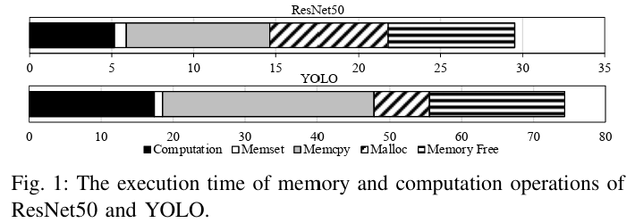

# Occamy

# 요약

- problem1 : edge device 같은 경우 작은 memory size 때문에 돌릴 수 있는 NN이 제한 된다.
- problem2 : alloc, de-alloc 등 memory 관련 op들이 꽤 큰 latency를 차지한다.



- memory copy는 asynchronous copy로 가려질 수 있지만, memory alloc/de-alloc은 synchronization primitive 때문에
- design : occamy (3 steps)
    - Liveness-aware Memory Operation Insertion
        - Insert GPU memory operations (`malloc`, `memcpy`, `dealloc`) into DNN IR.
        - Use this data to build a **liveness table** per tensor.
        
        
        
        - 필요한 tensor 를 하나 하나 alloc하고 de-alloc하는 방식
        - Eager mode : 미리 alloc해서 할당해둠. (이러면 동 time에 여러 tensor들이 메모리를 차지하고 있어서 footprint를 많이 못 가져감)
        - Lazy memory : 그때 그때 필요할 때 alloc하고 de-alloc 함. 이러면 OS system call, Mutex로 인한 atomic access 때문에 runtime이 느려짐.
        - 즉, eager vs. lazy는 footprint-runtime trade-off 관계임.
        - 본 논문에서는 liveness table을 만들어서, A와 B가 서로 다른 time에 필요하면, A를 위해 alloc한 공간을 B을 위해서도 쓰는 방식.
            - (기존) A alloc → A 사용 → A de-alloc → B alloc → B 사용 → B de-alloc
            - (제안) A alloc → A 사용 → B 사용 → A de-alloc
    - Use this data to build a **liveness table** per tensor.
        - **Layer Fusion** : Merge compatible operations (e.g.)
        
        ```
        Conv + ReLU → Conv-ReLU
        ```
        
        - Tensor Coalescing: Reuse memory between input and output tensors for **elementwise ops** (e.g.,)
        
        ```
        Add
        ```
        
        - avoids extra memory for temporary outputs.
        - → Fewer memory allocations, more memory reuse.
    - **Memory Pool Code Generation** :Generates instructions to emulate mallocs within the pool. → Eliminates need for dynamic allocation or deallocation calls at runtime.
    
    ```
    DNN.Mem-offset(base, offset, size)
    ```
    
- implementation
    - Built on **MLIR** by extending **ONNX-MLIR** (originally CPU-only).
    - Added GPU support with CUDA backend.
    - Compiles ONNX models into LLVM IR with memory pool logic.

```cpp
ONNX IR -> DNN IR -> LLVM IR -> executible binary
```

ONNX , DNN IR level에서 liveness table을 유지하고, DNN IR level에서 layer fusion/Tensor coaleascing을 유지하고, DNN IR level에서 memory pool 관련된 (de)alloc도 일원화해서 마지막으로 LLVM IR로 간다. 물론 MLIR 특징 처럼 DNN IR 단계에서 ONNX IR도 일부 존재한다. 이후, `DNN.Conv` 등의 IR은 cuDNN kerenl call로 대체하고, link 걸어서 GPU 를 enable 한다. 


# implemetation tools (나의 추측)

|  Step | Verdict | Notes |
| --- | --- | --- |
| ONNX-MLIR frontend | ✅ ✔️ | Used ONNX dialect as input |
| ONNX → DNN IR | ✅ ✔️ | Via MLIR rewrite passes |
| Optimization passes | ✅ ✔️ | Custom MLIR passes for fusion & pooling |
| DNN IR → LLVM IR | ✅ ✔️ | Using MLIR pattern rewrites |
| Linking with cuDNN | 🔶 Mostly right | Probably used `clang -lcudnn`, not `llc` directly |
| Executable binary | ✅ ✔️ | Result is a GPU-inference binary |

# implementation details

MLIR level에서 모든 optimization 작업을 하고, 새로운 instruction들도 집어 넣는다. 하지만 마지막에 LLVM IR로 가서 ptx로 code-gen 할 수 있게끔 한다. 

```cpp
ONNX IR → DNN IR (MLIR) → LLVM IR → CUDA Runtime API → Executable
```

MLIR에서는 dialect 하나를 추가했다.

하나의 instruction을 보여주는 구체적 예시

```cpp
onnx.Conv → DNN.Conv → LLVM call to cudnnConvolutionForward()
```

call 하는 부분이 바로 이 논문에서 얘기하는 “CUDA Runtime API”이다. 

| CUDA Runtime API | LLVM IR Call |
| --- | --- |
| `cudaMalloc` | `call i32 @cudaMalloc(i8**, i64)` |
| `cudaMemcpy` | `call i32 @cudaMemcpy(i8*, i8*, i64, i32)` |
| `cudaFree` | `call i32 @cudaFree(i8*)` |
| `cudnnConvolutionForward` | `call i32 @cudnnConvolutionForward(i8*, ...)` |

### 🛠️ a. **Custom GPU Memory Management Dialect (DNN IR)**

- Defined MLIR operations like:
    - `DNN.Malloc`, `DNN.Memcpy`, `DNN.Mem-offset`, `DNN.Dealloc`
    - `DNN.Conv`, `DNN.Add`, and fused variants

LLVM 쪽은 다음과 같은 연결을 해줬다.

### 🛠️ c. **GPU Lowering to LLVM IR with CUDA Runtime Integration**

- Lowered DNN IR into **LLVM IR**
    - Inserted calls to `cudaMalloc`, `cudaMemcpy`, and others
    - Generated PTX using LLVM’s NVPTX backend
    - Linked CUDA host and kernel code for execution

다음은 MLIR → LLVM example 이다.

```cpp
%pool = DNN.Pool-init 2048 : memref<2048xi8>

%a = DNN.Mem-offset %pool, 0, 768 : memref<768xf32>
%b = DNN.Mem-offset %pool, 768, 540 : memref<540xf32>
%c = DNN.Mem-offset %pool, 1308, 20 : memref<20xf32>

DNN.Memcpy %a, %input_host : memref<768xf32> // H->D
DNN.Conv %a, %b, %c, %out : memref<720xf32>
```

```cpp
@cudaMalloc = declare i32 @cudaMalloc(i8** %devPtr, i64 %size)
@cudaMemcpy = declare i32 @cudaMemcpy(i8* %dst, i8* %src, i64 %count, i32 %kind)
@cudaFree = declare i32 @cudaFree(i8* %devPtr)

; Allocate unified memory pool
%pool_ptr_ptr = alloca i8*
call i32 @cudaMalloc(%pool_ptr_ptr, 2048)
%pool = load i8*, i8** %pool_ptr_ptr

; Offset pointer: %a = pool + 0
%a = getelementptr i8, i8* %pool, i64 0
%b = getelementptr i8, i8* %pool, i64 768
%c = getelementptr i8, i8* %pool, i64 1308

; H to D copy
call i32 @cudaMemcpy(i8* %a, i8* %input_host, i64 768, i32 1) ; cudaMemcpyHostToDevice

; Launch convolution kernel (assume kernel is precompiled or emitted elsewhere)
call void @conv_kernel(i8* %a, i8* %b, i8* %c, i8* %out)

```

## 🔹 3. Linking with CUDA Runtime (Host + Device Code)

Occamy needs to:

- Emit the **LLVM IR** with CUDA runtime calls
- Compile **PTX kernels** or link **cuDNN/cuBLAS** functions
- Use `clang` or `nvcc` to compile + link

Or if using cuDNN:

```cpp
cudnnConvolutionForward(handle, ... a, b, c, out ...);

```

즉, 강의 때 했듯이, function call을 구현해서 cuda kernel을 call하는 방식으로 짠 것이다. `cudnnConvolutionForward()` is a **precompiled cuDNN GPU kernel**, part of the **CUDA Deep Neural Network library.**

### 🔧 Key Components Added by Occamy:

### 🔹 1. **DNN IR with CUDA Runtime Abstractions**

Occamy defines a **new intermediate IR** (DNN IR) with GPU semantics:

- Memory ops: `DNN.Malloc`, `DNN.Memcpy`, `DNN.Dealloc`
- Pool ops: `DNN.Pool-init`, `DNN.Mem-offset`
- Compute ops: `DNN.Conv`, `DNN.Add`, possibly fused versions

These are **high-level GPU-aware operations** that will eventually become CUDA calls.

---

### 🔹 2. **Lowering to LLVM IR with CUDA Calls**

Occamy rewrites DNN IR into **LLVM IR** using:

- **CUDA runtime API** (`cudaMalloc`, `cudaMemcpy`, `cudaFree`)
- Possibly **CUDA kernel launches** (for ops like `Conv`, `Relu`, etc.)

This is done through **custom MLIR to LLVM IR conversion passes**, which:

- Replace `DNN.Malloc(...)` → `llvm.call @cudaMalloc(...)`
- Replace `DNN.Memcpy(...)` → `llvm.call @cudaMemcpy(...)`
- Replace `DNN.Conv(...)` → CUDA kernel launch or a cuDNN call

📌 This mirrors what MLIR does with CPU code (e.g., lowering `memref.alloc` → `malloc`), but **for CUDA**.

Lower entire IR into LLVM IR so that standard LLVM passes (NVPTX codegen, inlining, etc.) can kick in

### ✅ Step 3: Building the Executable for CUDA

After generating LLVM IR with CUDA function calls:

- Occamy invokes **LLVM's NVPTX backend** (via `llc`) to emit **PTX**
- PTX is linked with CUDA host code (using `nvcc` or `clang --cuda`)
- The result is an **executable binary** or a **shared object** to run inference

---

### ✅ Step 4: Memory Pool Management in CUDA

Instead of using many `cudaMalloc`/`cudaFree`, which are expensive:

- Occamy generates **one `cudaMalloc`** at the start:
    
    → `DNN.Pool-init(size)` → `cudaMalloc(&pool, size)`
    
- All tensors are mapped to **offsets in this pool**
    
    → `DNN.Mem-offset(pool, offset, size)` is treated as a pointer arithmetic: `pool + offset`
    
- No more malloc/free during execution
    
    → Reduces runtime overhead and memory fragmentation
    

# 의문점

## 어떻게 CPU only 인 ONNX-MLIR로 GPU kernel을 만들었을까?

1. ONNX-MLIR이 front-end 로써 CPU only 지만, MLIR의 GPU related MLIR(`vector`, `linalg`, or `gpu`)로 lowering 했을 수도 있다. (추측, 아님.)
2. cuda kernel call을 했고, 해당 kernel들은 이미 SIMD가 되어 있기 때문에 가능했을 것이다. (분명함)
